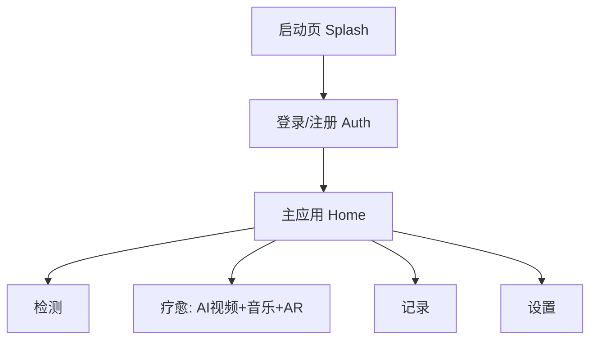

# HealGlass 移动端 UI 原型

这是一个纯前端静态页面原型，采用更精简的交互逻辑并保留核心功能：
- 启动页（Google/Gemini 风格）
- 登录/注册
- 主应用 5 个底部菜单页：首页 / 检测 / 疗愈 / 记录 / 设置
- 核心功能：情绪检测模拟、AI 疗愈流程推进、AR 预览与音乐控制

## 如何运行

```bash
cd /workspace/ar-healing-glass
python3 -m http.server 4173
```

浏览器访问：

```text
http://127.0.0.1:4173/index.html
```

## 精简后的使用逻辑

1. 启动页点击「登录」
2. 在登录/注册页进入应用
3. 进入主应用后通过底部菜单切换 5 个功能页面

## 流程图（Mermaid）



## 代码结构

- `index.html`：页面结构与流程阶段
- `styles.css`：移动端样式
- `app.js`：交互逻辑
